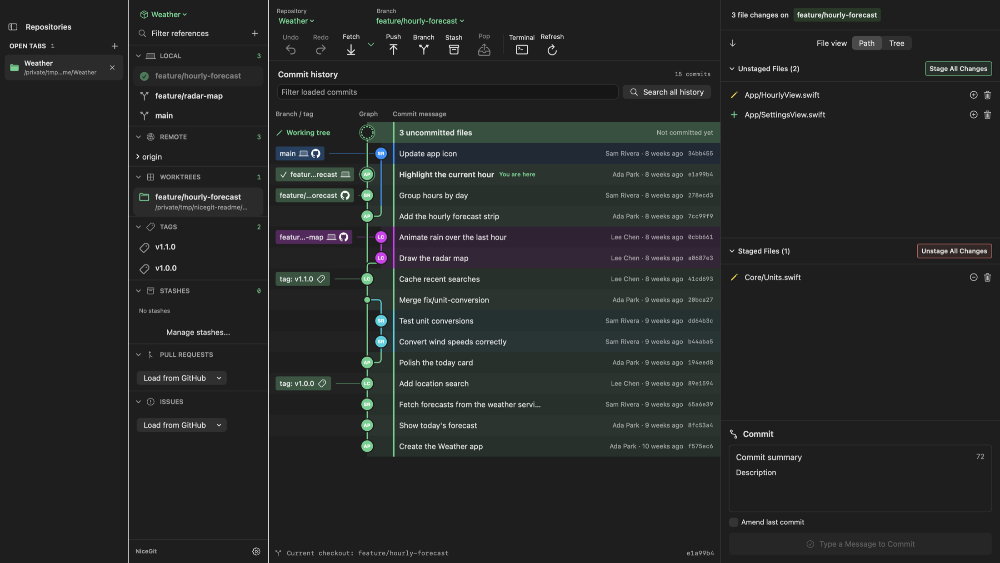
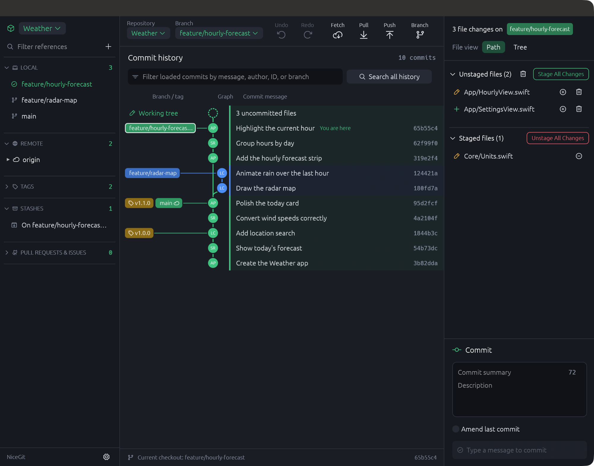

# NiceGit

**A fast Git client for macOS, Windows, and Linux. Free and open source.**



NiceGit puts your repositories, branches, history, and changes in one native Mac window.
Follow how commits connect, review and stage changes line by line, and rewrite history
with confidence: destructive actions confirm first, check that nothing changed behind
your back, and can usually be undone.

There is no account, subscription, or paid tier, and nothing is sent anywhere except by
Git itself. Built with SwiftUI and AppKit, and released under the [MIT License](LICENSE).

> **Preview software:** NiceGit is under active development. Back up important work
> before trying history-changing operations. The current version is 0.1.0.

## Highlights

**See your history**
- A commit graph with stable lanes and colours, branch and tag labels, author initials,
  and your uncommitted work connected to the commit it builds on.
- Blame any file, browse a file's history across renames, and compare any two commits
  or a commit with your working files, side by side or in one column.
- Search every branch's history by message, author, code change, or commit ID
  (Shift-Command-F), or search file contents at any commit (Option-Command-F).

**Make changes**
- Stage and unstage whole files or individual lines, edit working files in place, and
  keep a separate commit draft for each checkout.
- Interactive rebase: drag to reorder, and pick, reword, squash, fix up, or drop commits.
- Merge, rebase, cherry-pick one or many commits, revert, amend, reset, and resolve
  conflicts, with a preview of which files will conflict before you start.
- Find the commit that introduced a bug with bisect, guided from the graph.

**Stay safe**
- Undo the last commit, merge, rebase, reset, pull, cherry-pick, or branch deletion, and
  undo discarding a file's changes.
- Recover commits left behind by a reset or rebase from **Repository › Recover Lost Work**.
- Every destructive action checks that the branch, commit, or remote you saw is still the
  one it will change, and refuses if it is not.

**Manage repositories**
- Local and remote branches, tags, stashes (including selected files), linked worktrees,
  submodules, remotes, GitFlow, and Git LFS tracking.
- Branch clean-up for merged and inactive branches, identity profiles for work and
  personal email addresses, and commit signature status.

**Work quickly**
- A command palette for actions, branches, and repositories (Shift-Command-P).
- An embedded terminal for each checkout (Control-backtick).
- Automatic refresh when files change in other apps.
- Light and dark appearance, and a colour-blind safe graph palette (Command-comma).
- Pull requests and issues from github.com through your existing GitHub CLI login.

The [feature guide](docs/FEATURES.md) describes each feature's behaviour and safeguards.

## Install

### Download

Download the latest build for your system from
[Releases](https://github.com/daniaalnadir/NiceGit/releases):

| System | File |
| --- | --- |
| macOS 11 or newer (Apple Silicon and Intel) | `NiceGit-…-macos-universal.dmg` |
| Windows 10 or newer (64-bit) | `NiceGit-…-windows-x64.zip` |
| Debian, Ubuntu, and derivatives | `NiceGit-…-linux-amd64.deb` |
| Other Linux (x86_64) | `NiceGit-…-linux-x86_64.tar.gz` |

These are the cross-platform version, built in Rust from [`rust/`](rust). It has the
same features as the original Mac app described above: the commit graph and inspector,
line-by-line staging, interactive rebase, conflict editing, undo, blame, file history,
search, bisect, comparisons, worktrees, submodules, GitFlow, Git LFS, pull requests and
issues, the command palette, and an embedded terminal. Every version needs Git installed
and on your `PATH`.



Until the macOS download is notarized, macOS blocks it the first time it opens:
open it once, then choose **Open Anyway** in System Settings › Privacy & Security.

### Build the cross-platform version from source

Install [Rust](https://rustup.rs), then:

```sh
cd rust
cargo run --release
```

On Linux, first install the GTK 3, xkbcommon, and Wayland or X11 development
packages (for example `libgtk-3-dev libxkbcommon-dev libwayland-dev`).

### Build the Mac app from source

Requirements:

- macOS 14 or newer. Day-to-day testing uses recent macOS on Apple Silicon; older macOS
  versions and Intel Macs have not been verified at runtime.
- Xcode with Swift 6.3 or newer, its command-line tools selected, and first-launch setup
  completed.
- Git on your `PATH`.
- An internet connection for the first dependency download.

```sh
git clone https://github.com/daniaalnadir/NiceGit.git
cd NiceGit
bash scripts/build-app.sh release
open dist/NiceGit.app
```

The app is ad-hoc signed for your Mac's architecture. It is not Developer ID signed or
notarized, so copies downloaded from elsewhere may be blocked by macOS.

### Run without packaging

```sh
swift run --build-system native NiceGit
```

The native build backend avoids a SwiftTerm shader-build issue with the default
command-line backend; it currently prints a deprecation warning.

To run from Xcode, open `Package.swift`, choose the **NiceGit** scheme (not
`NiceGitCore` or `NiceGit-Package`) and **My Mac**, then press Command-R. Use Command-.
to stop a previous run before starting another.

### Optional: GitHub pull requests and issues

Install [GitHub CLI](https://cli.github.com) and sign in:

```sh
gh auth login
```

Then choose a remote under **Pull Requests** or **Issues** in the sidebar. Only
github.com is supported. NiceGit reuses the CLI's login and stores no token of its own;
ordinary Git operations use your existing Git credentials.

## Development

```sh
swift test --build-system native
cd rust && cargo test
```

Tests run against disposable repositories and need no GitHub login. The opt-in
`UIDriverTests` drives the real window with clicks and key presses and saves a screenshot
after each step; its documentation comment explains how to run it.

| Folder | Contents |
| --- | --- |
| `Sources/NiceGit` | The Mac app's interface and application state |
| `Sources/NiceGitCore` | Git commands, parsers, the commit graph, and GitHub reads |
| `Tests` | Integration, regression, and interface tests |
| `scripts` | Packaging, icons, and preview fixtures |
| `rust/crates/nicegit-core` | The cross-platform Git commands, parsers, and commit graph |
| `rust/crates/nicegit` | The cross-platform interface; `src/tools` holds each feature window |

[CONTRIBUTING.md](CONTRIBUTING.md) covers the workflow, and [AGENTS.md](AGENTS.md)
records hard-won rules about Git edge cases that changes must respect.

## Limitations

- Pull requests and issues support github.com only, not GitHub Enterprise, GitLab, or
  Bitbucket. Pushing and pulling work with any Git remote.
- Undo covers the most recent undoable action, not a full history of every operation.
- Releases are not yet notarized and there are no automatic updates.
- The embedded terminal is a real shell, and Git hooks, filters, and shell startup files
  can run code. Only open repositories you trust.

NiceGit is an independent project and is not affiliated with any other Git client.

## Contributing

Bug reports and focused pull requests are welcome. Please include your macOS version, the
NiceGit version, and steps to reproduce with a disposable repository, and remove private
paths, repository content, and credentials from screenshots and logs.

- [Contribution guide](CONTRIBUTING.md)
- [Security policy](SECURITY.md)
- [Changelog](CHANGELOG.md)
- [Release checklist](docs/RELEASING.md)
- [Verification notes](VERIFICATION.md)

## License

Copyright (c) 2026 Daniaal. Licensed under the [MIT License](LICENSE), which permits use,
modification, redistribution, and commercial use as long as the copyright and license
notices are kept. Dependencies keep their own licenses; see
[Third-Party Notices](THIRD_PARTY_NOTICES.md).
